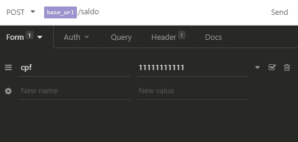

# CONFIGURAR PROJETO 

## REQUISITOS
* PHP >= 7.0
* XAMP ou similares
* Insomnia ou Postman (para testar as requisições)

**OBS:** O .htaccess e web.config (iis) são responsável pela url amigável

## CRIAR O BANCO DE DADOS
Utilize o arquivo jessmede_controle_financeiro.sql que está na raiz do projeto para criar o banco de dados na sua máquina ou no seu servidor.
Caso precise trocar os dados da conexão com o banco de dados está no ConexaoModel.php : 
```
$usuario = 'root';
$senha = '5@j4F#45';
self::$conexao = new \PDO('mysql:host=localhost;dbname=jessmede_controle_financeiro;',$usuario,$senha);
```

## URLs da API 

Para obter o extrato do cliente utilize a url abaixo e passe via POST o **CPF**:
```
 /extrato  
```


Para obter o saldo do cliente utilize a url abaixo e passe via POST o **CPF**:
```
 /saldo  
```


Para debitar do saldo do cliente utilize a url abaixo e passe via POST o **CPF** e **VALOR** (o valor pode ser passado posivo ou negativo ex. -100 ou 100) a ser debitado:
```
 /debito  
```


Para creditar no saldo do cliente utilize a url abaixo e passe via POST o **CPF** e **VALOR** (o valor pode ser passado posivo ou negativo ex. -100 ou 100) a ser creditado:
```
 /credito  
```


## URLs da API 
Para transferir um valor do saldo do cliente A para o cliente B utilize a url abaixo e passe via POST o **CPF** do cliente A e **CPF_DESTINATARIO** e **VALOR** a ser transferido:
```
 /transferencia  
```


**OBS:** Usar **FORM** para enviar os dados (Insomnia o Postman)

